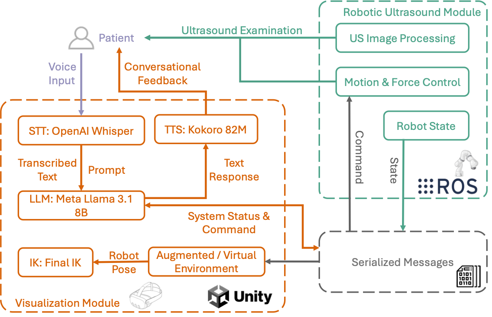

# Enhancing Patient Acceptance of Robotic Ultrasound through Conversational Virtual Agent and Immersive Visualizations (IEEE VR 2025 Honorable Mention for Best Paper)

## Abstract
We present a novel system that integrates a conversational virtual agent, powered by a large language model, with two immersive visualization modalities—augmented reality (AR) and virtual reality (VR). The virtual agent engages patients through natural dialogue, utilizing real-time speech-to-text and text-to-speech systems to provide clear guidance and reassurance throughout the procedure. The AR visualization allows patients to remain aware of the robot while interacting with the virtual assistant, whereas the VR visualization fully immerses patients in a virtual environment where the robot is hidden, offering a more relaxed experience. This demo will showcase how combining adaptive communication with immersive environments can bridge the gap between robotic automation and patient-centered care in medical procedures.

[](https://youtu.be/d0QiQl0_-mc)

## System Architecture 
Our system now can be fully local hosted without relying on cloud services (different from the paper).

<p align="center">
	
</p>

## Code will be released soon!


## Disclaimer
Due to licensing issues with some third-party plugins and libraries, we are unable to share certain components on GitHub. Specifically, the following plugins used in the original paper are not included in this repository:

- [**Final-IK**](https://assetstore.unity.com/packages/tools/animation/final-ik-14290).
- [**SALSA LipSync Suite tool**](https://assetstore.unity.com/packages/tools/animation/salsa-lipsync-suite-148442)

If you require these plugins for your work, please refer to the official sources for obtaining them.

## Cite Us

```
@ARTICLE{song2025Enhancing,
  author={Song, Tianyu and Pabst, Felix and Eck, Ulrich and Navab, Nassir},
  journal={IEEE Transactions on Visualization and Computer Graphics}, 
  title={Enhancing Patient Acceptance of Robotic Ultrasound through Conversational Virtual Agent and Immersive Visualizations}, 
  year={2025},
  volume={31},
  number={5},
  pages={2901-2911},
  keywords={Robots;Ultrasonic imaging;Visualization;Mixed reality;Medical services;Virtual assistants;Real-time systems;Virtual environments;Three-dimensional displays;Probes;Mixed Reality;Virtual Agent;Robotic Ultrasound;Trust and Acceptance},
  doi={10.1109/TVCG.2025.3549181}}
```
